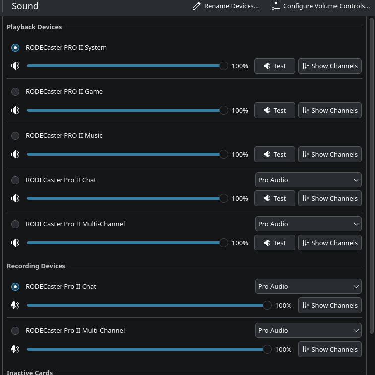

# Rodecaster Pro II: Virtual Audio Devices for PipeWire
This repository provides a simple configuration script that automatically sets up virtual audio devices for the 
Rodecaster Pro II using PipeWire. 



## Installing the Configuration
You can install this configuration by using one of the following methods.

> [!IMPORTANT]  
> You need to select the 'Pro Audio' profile for your device for the virtual devices to work correctly.

### Method 1: Using the installation script
Run the provided installation script to set up the virtual audio devices automatically:
```bash
curl -sfL https://parzival-space.github.io/rodecaster-pro-2-virtual-devices-pipewire/configure.sh | sh -s - --install
```

### Method 2: Cloning the repository
Alternatively, you can clone the repository and run the configuration script locally:
```bash
git clone https://github.com/parzival-space/rodecaster-pro-2-virtual-devices-pipewire.git
cd rodecaster-pro-2-virtual-devices-pipewire
./configure.sh --install
```

## License
This project is licensed under the MIT License. See the [LICENSE](LICENSE) file for details.