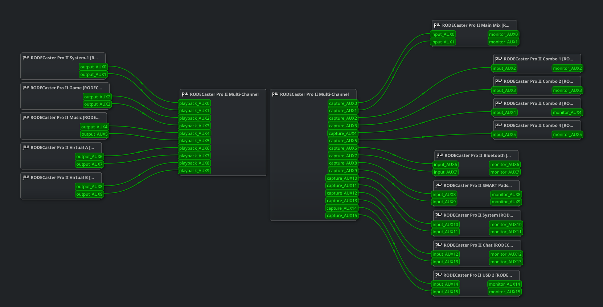
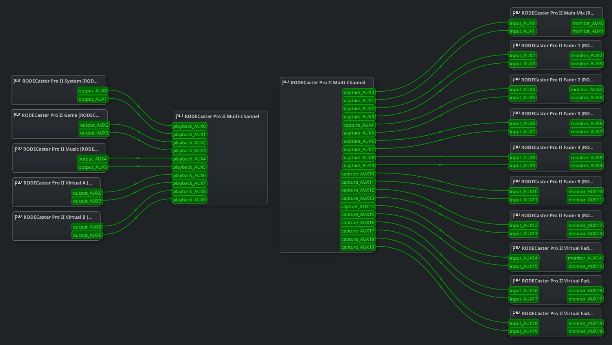
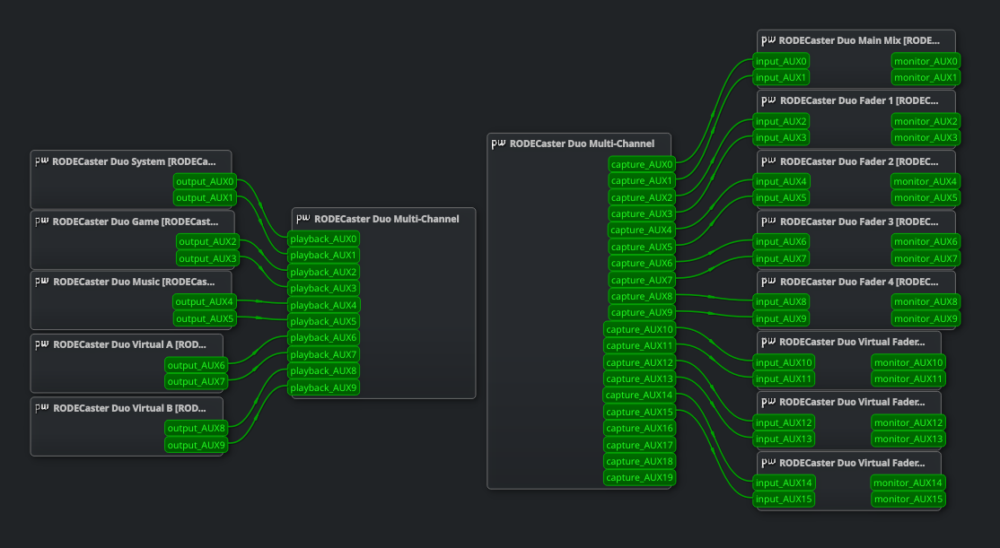

# Rodecaster Devices: Virtual Audio Devices for PipeWire

This repository provides a simple configuration script that automatically sets up virtual audio devices for supported
RODECaster devices using PipeWire.

Please [create an issue](https://github.com/parzival-space/rodecaster-pro-2-virtual-devices-pipewire/issues/new) if you
notice any missing channels or have any suggestions for improvement.

## Supported Devices

- RODECaster Pro II firmware 1.6.8
- RODECaster Pro II firmware 1.7.3
- RODECaster Duo firmware 1.7.3

The RODECaster Duo 1.7.3 template currently exposes 4 physical faders, 5 virtual faders, and the same 5 output sinks
used by the Pro II 1.7.3 template.

<table>
    <thead>
        <tr>
            <td align="center">
                Firmware 1.6.8 Virtual Devices
            </td>
            <td align="center">
                Firmware 1.7.3 Virtual Devices
            </td>
            <td align="center">
                RODECaster Duo 1.7.3 Virtual Devices
            </td>
        </tr>
    </thead>
    <tbody>
        <tr>
            <td align="center">
                
            </td>
            <td>
                
            </td>
            <td>
                
            </td>
        </tr>
    </tbody>
</table>

> [!IMPORTANT]
> Proper support for the virtual devices has been added to Alsa UCM project (wich is part of all major Linux distributions).
> Once the new UCM configuration gets released, you can simply update your system's alsa-ucm-conf package to get the virtual devices.
>
> **Additional note for Arch Linux users:**  
> You can use the [alsa-ucm-conf-git](https://aur.archlinux.org/packages/alsa-ucm-conf-git/) AUR package to get the latest UCM configuration with support for the virtual devices.
> This way you don't have to run this configuration script.
>
> ```bash
> yay -S alsa-ucm-conf-git
> ```

## Installing the Configuration

You can install this configuration by using one of the following methods.

<b>
You need to enable Multitrack Input and Output on the connected RODECaster device before running the installation script.
</b>

> [!IMPORTANT]
> If you are using an immutable system (e.g. Bazzite) or don't have write permissions to the system-wide PipeWire 
> configuration directory, you can use the `--user` flag with the installation script to install the virtual devices 
> for the current user only.
> 
> ```text
> ./configure.sh --install --user
> ```

### Method 1: Using the installation script

Run the provided installation script to set up the virtual audio devices automatically:

```bash
curl -sfL https://parzival-space.github.io/rodecaster-pro-2-virtual-devices-pipewire/configure.sh | sh -s - --install
```

### Method 2: Cloning the repository

Alternatively, you can clone the repository and run the configuration script locally:

```bash
git clone https://github.com/parzival-space/rodecaster-pro-2-virtual-devices-pipewire.git
cd rodecaster-pro-2-virtual-devices-pipewire
./configure.sh --install
```

The installer detects the connected device automatically and selects the matching template for supported Pro II and Duo
models.

## License

This project is licensed under the MIT License. See the [LICENSE](LICENSE) file for details.
